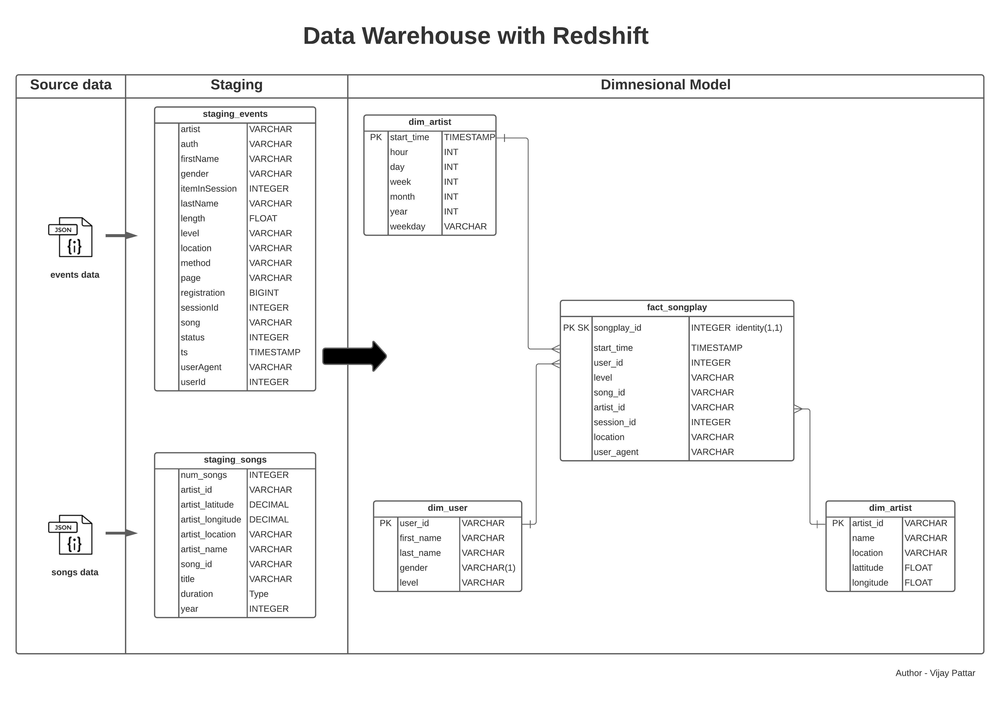

# Project Description

Sparkify is a music streaming company and has seen growth in the user base and the songs database. Sparkify wants analyse the user activity and songs data on their app. The analytics team is particularly interested in understanding what songs users are listening to. The data user activity and metadata on songs is stored in json format and makes it difficult to analyse the data. 
Sparkify wants to move all their processes and data to the cloud as scalability and elacticity is offered out of the box. Sparify want to use the AWS managed services so that the OpEx is minimised. 

## Solution

Amazon Redshift is a cloud based datawarehouse offering which is designed for large scale data set storage and analysis will be used to stage the data and transformed into dimensional model. The source data in JSON format will be stored in the S3 bucket. ETL pipeline will be built to stage the data in Amazon Redshift and transformed into dimensional tables to enable analytics team to find insights about songs users are listening to.

### Data Analysis

#### Analysing the data source 

##### Song dataset 
##### (Source : s3://udacity-dend/song_data)

<code>
{
   "artist_id":"ARJNIUY12298900C91",
   "artist_latitude":null,
   "artist_location":"",
   "artist_longitude":null,
   "artist_name":"Adelitas Way",
   "duration":213.9424,
   "num_songs":1,
   "song_id":"SOBLFFE12AF72AA5BA",
   "title":"Scream",
   "year":2009
}
</code>

##### Analysing the events data 
##### (Source : s3://udacity-dend/log_data)

<code>
{
   "artist":null,
   "auth":"Logged In",
   "firstName":"Walter",
   "gender":"M",
   "itemInSession":0,
   "lastName":"Frye",
   "length":null,
   "level":"free",
   "location":"San Francisco-Oakland-Hayward, CA",
   "method":"GET",
   "page":"Home",
   "registration":1540919166796.0,
   "sessionId":38,
   "song":null,
   "status":200,
   "ts":1541105830796,
   "userAgent":"\"Mozilla\/5.0 (Macintosh; Intel Mac OS X 10_9_4) AppleWebKit\/537.36 (KHTML, like Gecko) Chrome\/36.0.1985.143 Safari\/537.36\"",
   "userId":"39"
}
</code>

##### jason path contains the structure of the events data which will be used to stage the data in parallel to redshift
##### (Source: s3://udacity-dend/log_json_path.json)

<code>
{
    "jsonpaths": [
        "$['artist']",
        "$['auth']",
        "$['firstName']",
        "$['gender']",
        "$['itemInSession']",
        "$['lastName']",
        "$['length']",
        "$['level']",
        "$['location']",
        "$['method']",
        "$['page']",
        "$['registration']",
        "$['sessionId']",
        "$['song']",
        "$['status']",
        "$['ts']",
        "$['userAgent']",
        "$['userId']"
    ]
}

</code>

## ETL - Dataflow

# Implementation

config parser is used to store all the credentials.

**[sql_queries.py](sql_queries.py)** - contains the configuration information and the definition (sql code) to create the staging and star schema table. 

**[create_tables.py](create_tables.py)** contains code to create all the staging tables and star schema tables 

**[etl.py](etl.py)** is where you'll load data from S3 into staging tables on Redshift and then process that data into your analytics tables on Redshift.

